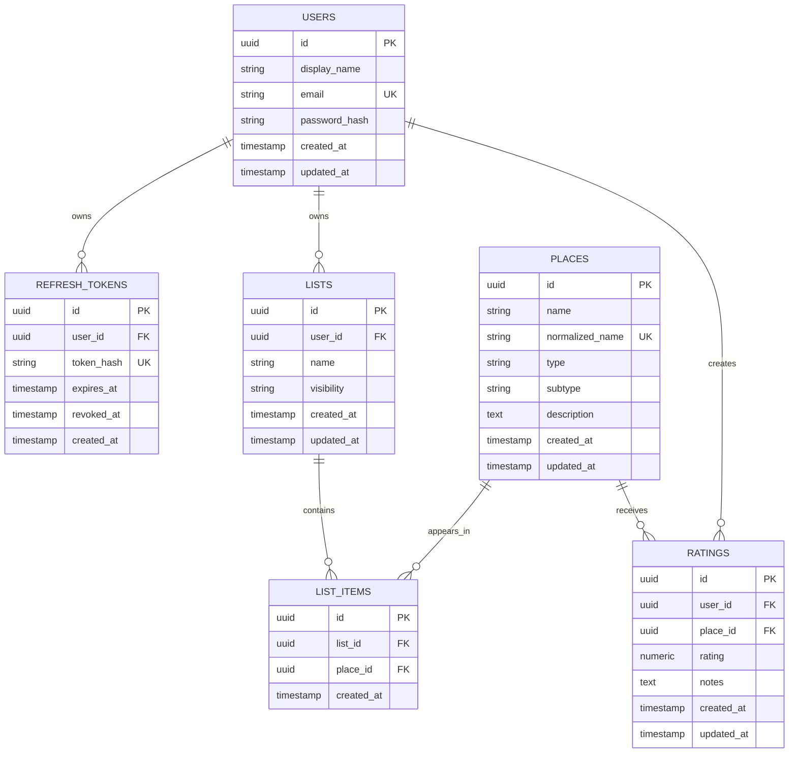

# 11. ERD

## Entity Relationship Diagram

## Cardinality

| Relationship | Cardinality | Notes |
| --- | --- | --- |
| User to Refresh Tokens | One to many | A user can have multiple active or revoked refresh tokens. |
| User to Lists | One to many | A user can own many lists. A list has one owner. |
| User to Ratings | One to many | A user can rate many places. A rating has one owner. |
| List to Places | Many to many | Implemented through `list_items`. |
| Place to Ratings | One to many | A place can receive many ratings. |
| User to Place through Rating | Many to many with uniqueness | One rating per user per place. |

## Required Unique Constraints

- `users.email` must be unique after normalization.
- `refresh_tokens.token_hash` must be unique.
- `places.normalized_name` must be unique.
- `ratings(user_id, place_id)` must be unique.
- `list_items(list_id, place_id)` must be unique.
- `ratings.rating` must be 1 through 10 in 0.5 increments.

## Derived Concepts

| Concept | Derivation |
| --- | --- |
| Tried place for a user | A place with a rating row where `ratings.user_id = current_user.id`. |
| Tried indicator | Exists when current user has a rating for the place. |
| Restaurant tried count | Count of current user's ratings joined to places where `places.type = restaurant`. |
| Cafe tried count | Count of current user's ratings joined to places where `places.type = cafe`. |
| Ice cream tried count | Count of current user's ratings joined to places where `places.type = ice_cream`. |
| Community average rating | Average of all `ratings.rating` values for a place, displayed with one decimal place. |
| Community rating count | Count of all ratings for a place. |
